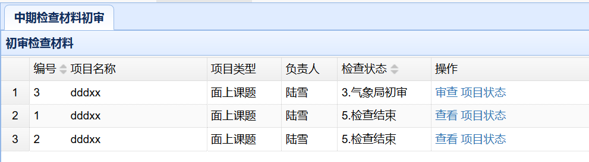
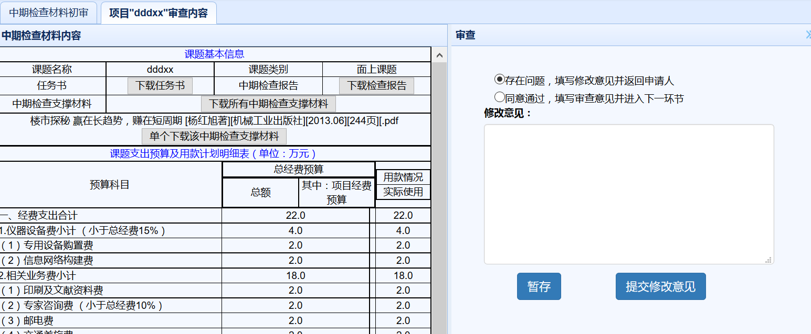
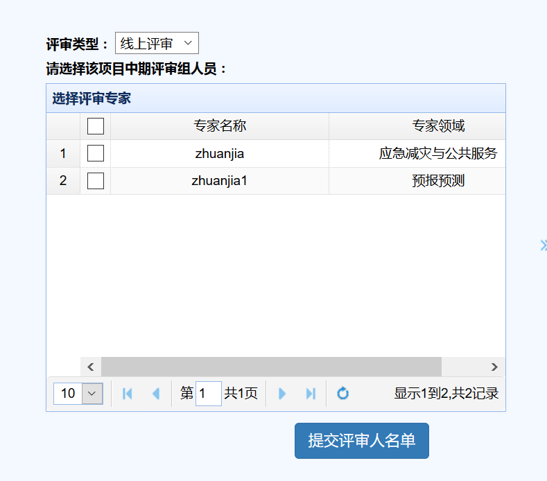

项目实施阶段（气象局管理员）

　　用户在主界面上部导航条点击`项目实施阶段`，即可进入实施阶段界面。
# 中期检查材料初审
## 检查材料列表
　　在项目实施阶段界面，点击左侧`中期检查材料初审`链接，可以显示中期检查材料初审模块，如下图所示，显示界面中包含了所有需审查的项目列表。

## 中期检查材料初审
　　列表中，检查状态一栏中应该进行处理的课题显示在最前面，并能进行审查操作，如果状态不是当前进行处理的，则操作一栏中只显示查看。其他操作同负责人操作。点击`审查`后，能查看申请项目的基本信息，如下图。

　　点击特定材料后的下载按钮可以直接下载该材料，点击`下载所有中期检查支撑材料`，可以将所有中期检查支撑材料打成压缩包下载。
　　右边是审查界面，若选择存在问题选项，则在下方填写修改意见，提交修改意见后会返回给申请人，课题状态恢复成第一步`1.填写检查材料`。点击暂存按钮则是临时保存修改意见。
　　若没有问题，则选择同意通过选项，并点击`提交审查意见`，来到评审委员选择界面。如下图所示。

选择1位或多位评审专家后，点击`提交评审人名单`，成功后项目进入下一状态`4.专家评审`状态。
