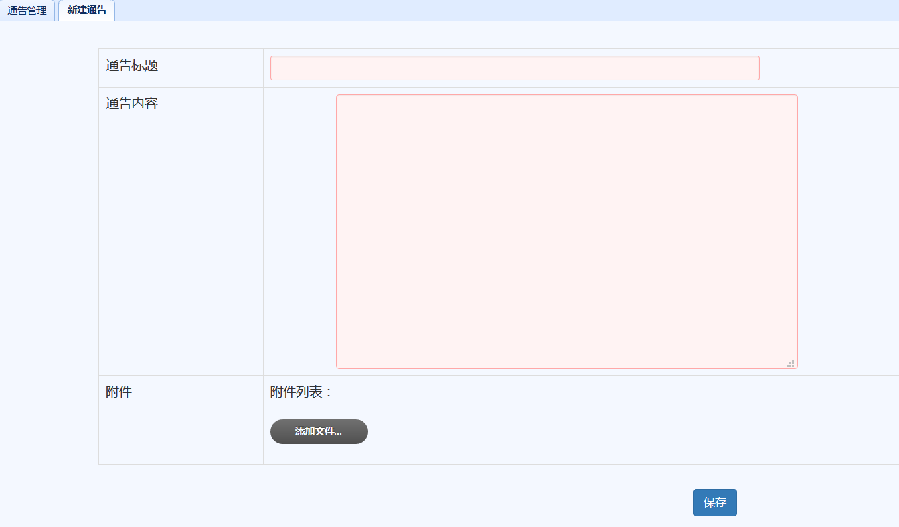
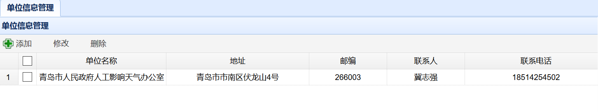
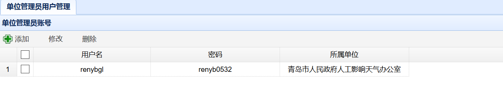
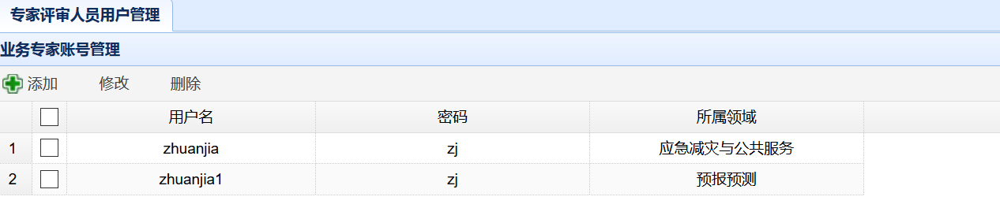
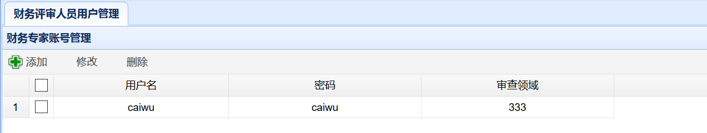
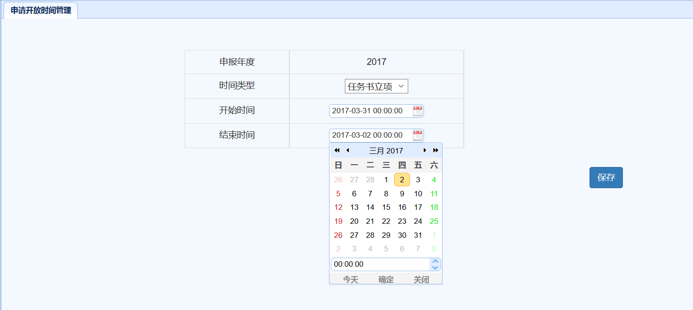
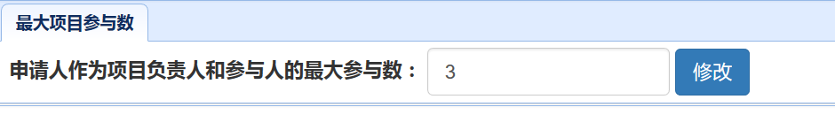

# 登录及信息管理（气象局管理员）
## 登录
　　气象局管理员打开“科研管理系统”主页，登录操作见申请人。

## 基本信息管理
### 通告管理
　　气象局管理员点击上方菜单的`基本信息管理`后，再点击左侧导航菜单的`通告管理`可以对通告进行管理。
　　在通告列表页面点击`新建通告`可以新建一条公告，如下图所示。输入标题、内容后点击`添加文件`可以添加附件，点击`保存`后会保存通告并发布。

　　在通告列表页面点击`编辑`可对通告进行修改，点击`删除`可对通告进行删除。

### 单位信息管理
　　气象局管理员点击上方菜单的`基本信息管理`后，再点击左侧导航菜单的`单位信息管理`可以对单位信息进行管理。如下图所示。
* 单击`添加`可以添加新的单位
* 单击前方选择框选择某一单位后点击`修改`（或者直接双击某一单位）可以对单位信息进行修改，修改完内容后点击`保存`可以完成修改操作。
* 单选或者多选单位后点击删除可以删除单位信息

***注意：只有新建单位后才能创建隶属于该单位的单位管理员。***

### 单位管理员用户管理
　　气象局管理员点击上方菜单的`基本信息管理`后，再点击左侧导航菜单的`单位管理员用户管理`可以对单位管理员信息进行管理。如下图所示。
* 单击`添加`可以添加新的单位管理员
* 单击前方选择框选择某一单位管理员后点击`修改`（或者直接双击某一单位管理员）可以对信息进行修改，修改完内容后点击`保存`可以完成修改操作。
* 单选或者多选单位管理员后点击删除可以删除单位管理员信息

***注意：只有新建单位管理员后，该管理员才能进行登录并且创建该单位成员信息。***

### 专家评审人员用户信息管理
　　气象局管理员点击上方菜单的`基本信息管理`后，再点击左侧导航菜单的`专家评审人员用户信息管理`可以对评审人员信息进行管理。如下图所示。
* 单击`添加`可以添加新的评审专家
* 单击前方选择框选择某一评审专家后点击`修改`（或者直接双击某一评审专家）可以对单位信息进行修改，修改完内容后点击`保存`可以完成修改操作。
* 单选或者多选评审专家后点击删除可以删除评审专家

***注意：只有新建评审专家后该评审专家才能进行登录并且进行评审。***

### 财务评审人员用户信息管理
　　气象局管理员点击上方菜单的`基本信息管理`后，再点击左侧导航菜单的`财务评审人员用户信息管理`可以对财务评审人员信息进行管理。如下图所示。
* 单击`添加`可以添加新的财务评审专家
* 单击前方选择框选择某一财务评审专家后点击`修改`（或者直接双击某一财务评审专家）可以对单位信息进行修改，修改完内容后点击`保存`可以完成修改操作。
* 单选或者多选评审专家后点击删除可以删除财务评审专家

***注意：只有新建财务评审专家后该评审专家才能进行登录并且进行财务评审。***

### 申请开放时间管理
　　气象局管理员点击上方菜单的`基本信息管理`后，再点击左侧导航菜单的`申请开放时间管理`可以对申报时间进行窗口控制。
　　可以对`申请书立项`和`任务书立项`两种时间类型的窗口时间进行选择设置，然后单击日期时间输入框右侧的日历对日期时间进行设置（也可以在日期时间输入框中直接按格式输入），选好日期后点击日期下拉框中的`确定`保存日期日渐，最后点击页面`保存`即可。如下图所示。

### 申请开放时间管理
　　气象局管理员点击上方菜单的`基本信息管理`后，再点击左侧导航菜单的`最大项目参与数`可以对申报时间进行窗口控制。如下图所示。

***注意：该项设置应该由气象局管理员首先设置后，才能允许申请人进行项目申请书的填报。***
