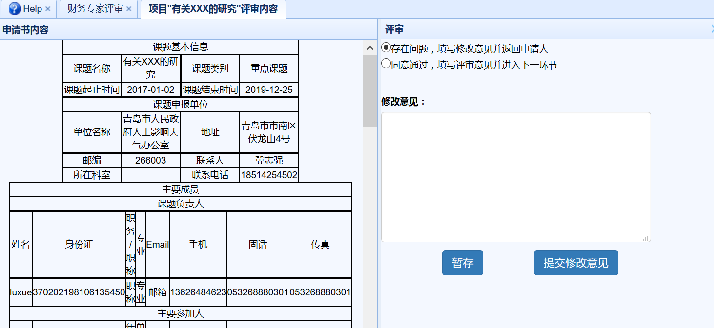

# 项目立项阶段（财务评审专家）
　　财务评审专家在主界面上部导航条点击`项目立项阶段`，即可进入立项阶段界面。
## 财务专家评审
　　在项目立项阶段界面，点击左侧`财务专家评审`链接，显示所有待评审的项目列表。点击待评审项目之后的`评审`链接，进入评审界面，如下图所示。

　　审查界面中，若选择存在问题选项，则在下方填写修改意见，提交修改意见后会返回给申请人，任务书状态恢复成`６.修改申请书并填报任务书`，点击`暂存`按钮则是临时保存修改意见。
　　若没有问题，则选择同意通过选项，并点击`提交修改意见`提交，项目状态变为`10.气象局任务书终审`。
　　如果完成所有项目审批，待审批任务书列表会为空。
