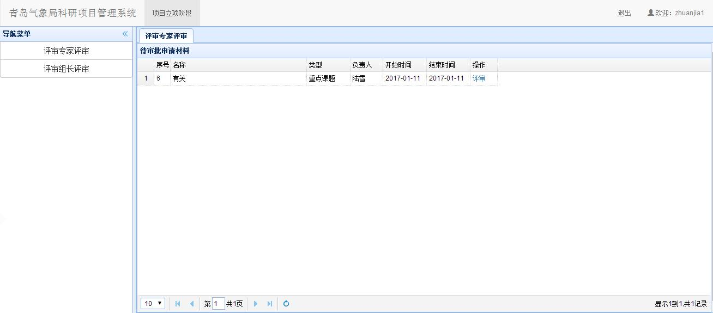
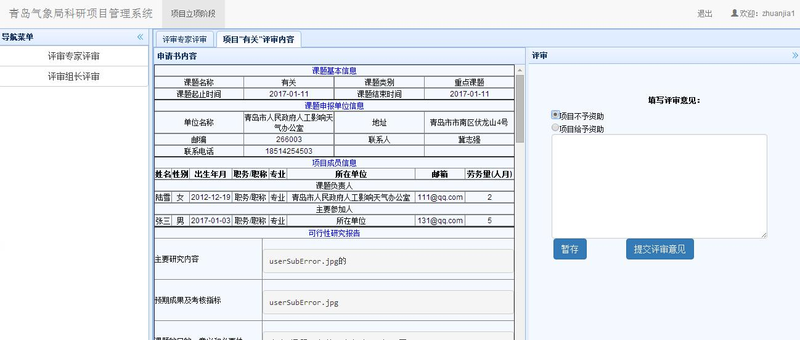
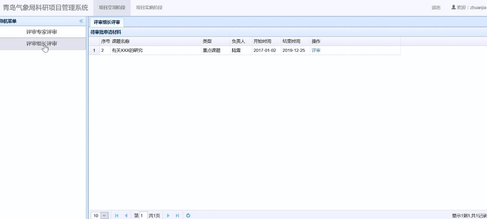
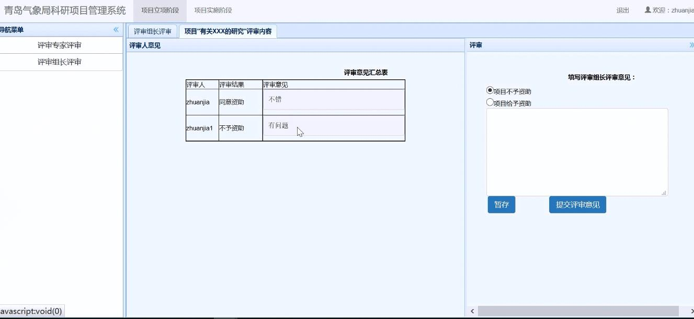
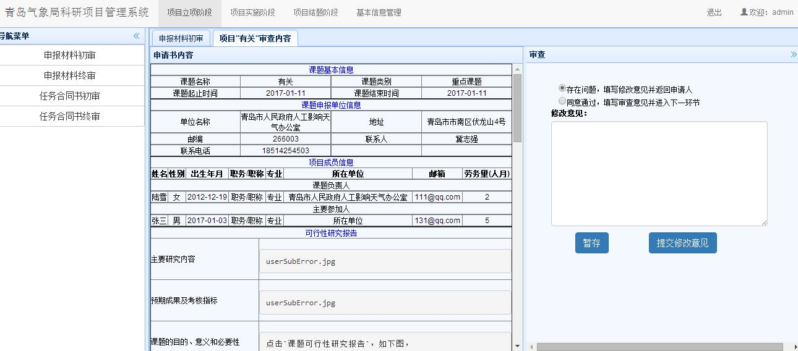

# 项目立项阶段
　　专家在主界面上部导航条点击`项目立项阶段`，即可进入立项阶段界面。
## 课题申请书评审
### 评审专家评审
　　在项目立项阶段界面，点击左侧`课题申请书初审`链接，可以显示课题申请书初审模块，显示界面中包含了当前单位的所有项目列表。根据评审类型：
　　1. 第一类`评审组长负责制`。
　　非组长登录后点击左侧导航栏`评审专家评审`，界面如下。

　　列表中，课题状态一栏中应该进行处理的课题显示在最前面，并能进行审查操作。点击`审查`后，能查看申请项目的基本信息，如下图。

　　右侧评审一栏处，可进行项目评审。选择`项目不予资助`，或者`项目给予资助`填写意见后提交修改意见，评审完成。
　　评审组长登录后，只有当全部评审专家评审完毕，然后点击导航栏出的`评审组长评审`，才会出现以下界面。进行评审。

　　点击`评审`操作后，组长可以看到所有评审专家的意见，如下图，在右侧由组长写汇总意见，并提交给气象局管理员。

　　

### 审查课题
　　列表中，课题状态一栏中应该进行处理的课题显示在最前面，并能进行审查操作，如果状态不是当前进行处理的，则操作一栏中只显示查看。其他操作同申请人操作。点击`审查`后，能查看申请项目的基本信息，如下图。
   
　　右边是审查界面，若选择存在问题选项，则在下方填写修改意见，如下图。提交修改意见后会返回给申请人，课题状态恢复成第一步`1.填写申报材料`，申请人登录后，通过点击课题申请书操作一栏中新增的`审查及评审意见`选项，查看意见后修改信息并提交给单位管理员，然后由单位管理员提交给气象局管理员。点击`暂存`按钮则是临时保存修改意见。

　　若没有问题，则选择同意通过选项，并点击`提交审查意见`，来到评审委员评审界面。其中评审类型选项共有两类：
　　第一类`评审组长负责制`是有多个专家进行评审，所有意见会汇总到评审组长处，由组长写汇总报给提交给气象局管理员。如下图，在选择组长下拉列表中选择评审组长，在选择评审专家出勾选参与评审专家。

　　第二类`评审委员评审制`是选择多个评审专家，所有意见共同呈现诶气象局管理员。
   ***注意：每次操作可再次点击左侧导航栏内模块刷新课题列表***
   提交成功后，课题进入`4.专家评审`状态。
