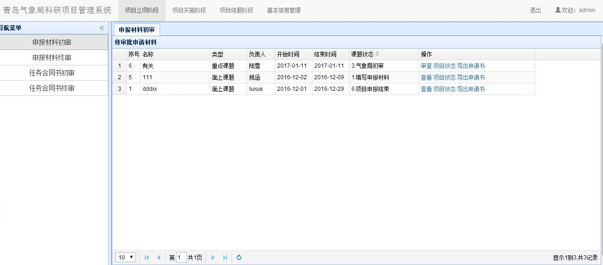
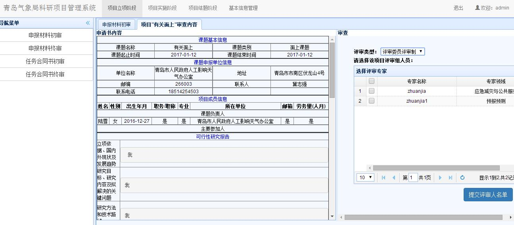
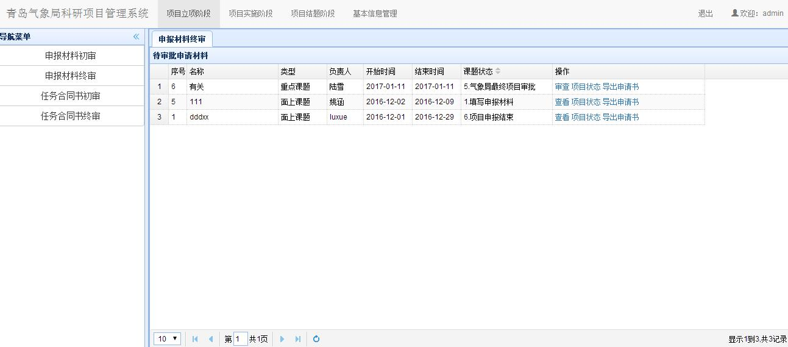

# 项目立项阶段
　　气象局管理员在主界面上部导航条点击`项目立项阶段`，即可进入立项阶段界面。
## 课题申请书初审
### 待审批申请书列表
　　在项目立项阶段界面，点击左侧`申报材料初审`链接，可以显示课题申请书初审模块，如下图所示，显示界面中包含了当前单位的所有项目列表。

### 申报材料初审
　　列表中，课题状态一栏中应该进行处理的课题显示在最前面，并能进行审查操作，如果状态不是当前进行处理的，则操作一栏中只显示查看。其他操作同申请人操作。点击`审查`后，能查看申请项目的基本信息，如下图。
   
　　右边是审查界面，若选择存在问题选项，则在下方填写修改意见，如下图。提交修改意见后会返回给申请人，课题状态恢复成第一步`1.填写申报材料`，申请人登录后，通过点击课题申请书操作一栏中新增的`审查及评审意见`选项，查看意见后修改信息并提交给单位管理员，然后由单位管理员提交给气象局管理员。点击`暂存`按钮则是临时保存修改意见。

　　若没有问题，则选择同意通过选项，并点击`提交审查意见`，来到评审委员评审界面。其中评审类型选项共有两类：
　　第一类`评审组长负责制`是有多个专家进行评审，所有意见会汇总到评审组长处，由组长写汇总报给提交给气象局管理员。如下图，在选择组长下拉列表中选择评审组长，在选择评审专家出勾选参与评审专家。

　　第二类`评审委员评审制`是选择多个评审专家，所有意见共同呈现诶气象局管理员。如下图，有多个评审委员评审完成后提交。

   ***注意：每次操作可再次点击左侧导航栏内模块刷新课题列表***
   提交成功后，课题进入`4.专家评审`状态。

### 申报材料终审
　　点击左侧导航栏的`申报材料终审`链接，若专家评审完毕，则出现`5.气象局最终项目审批`课题状态，如下图。

　　1. 第一类，`评审组长负责制`点击`审查`操作，进入审查界面如下图，只能看见组长的汇总。

　　
　　2. 第二类，`评审委员评审制`点击`审查`操作，进入审查界面如下图，能看见每一个评审专家的评审结果。

　　如果选择`项目给予资助`后提交，课题状态为`6.项目申报结束`，如下图。至此申报结束。
  
    如果选择`项目不予资助`，则申报也结束，但立项不成功。
