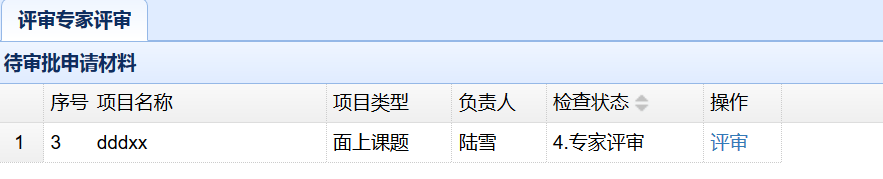
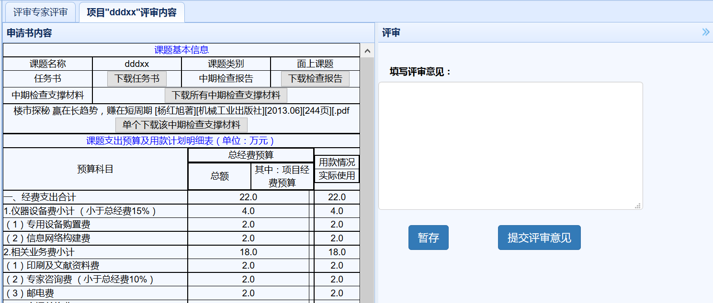

项目实施阶段（评审专家）

　　用户在主界面上部导航条点击`项目实施阶段`，即可进入实施阶段界面。
# 中期检查材料初审
## 检查材料列表
　　在项目实施阶段界面，点击左侧`评审专家评审`链接，可以显示所有待评审的项目列表，没有待评审的项目列表为空。

## 中期检查材料初审
　　列表中，点击项目之后的`评审`链接，能查看申请项目的基本信息，如下图。

　　点击特定材料后的下载按钮可以直接下载该材料，点击`下载所有中期检查支撑材料`，可以将所有中期检查职称材料打成压缩包下载。
　　右边是审查界面，点击暂存按钮则是临时保存修改意见。填写意见后，点击`提交评审意见`，提交后整个中期检查流程结束，项目进入状态`5.检查结束`。
