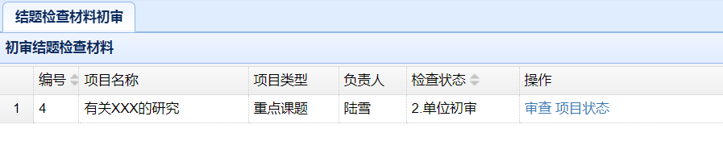
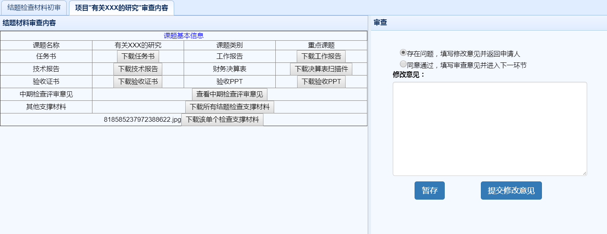
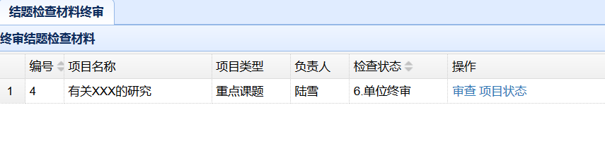
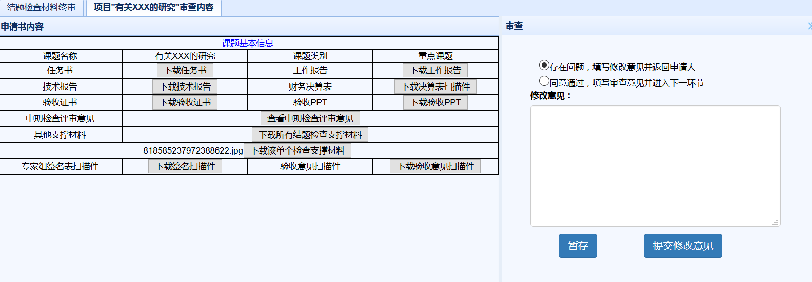
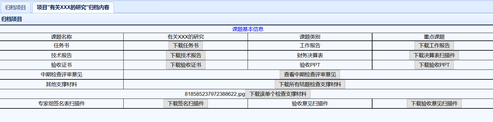

项目结题阶段（单位管理员）

　　用户在主界面上部导航条点击`项目结题阶段`，即可进入结题阶段界面。
# 结题检查材料初审
## 初审检查材料列表
　　在项目结题阶段界面，点击左侧`结题检查材料初审`链接，可以显示结题材料初审模块，如下图所示，显示界面中包含了当前单位的所有项目列表。

## 结题材料初审
　　列表中，检查状态一栏中应该进行处理的课题显示在最前面，并能进行审查操作，如果状态不是当前进行处理的，则操作一栏中只显示查看。其他操作同负责人操作。点击`审查`后，能查看申请项目的基本信息，如下图。

　　点击特定材料后的下载按钮可以直接下载该材料，点击`下载所有结题检查支撑材料`，可以将所有结题支撑材料打成压缩包下载。
　　右边是审查界面，若选择存在问题选项，则在下方填写修改意见，提交修改意见后会返回给申请人，课题状态恢复成第一步`1.填写结题材料`。
　　若没有问题，则选择同意通过选项，并点击`提交审查意见`，课题进入下一个状态`3.气象局初审`。点击暂存按钮则是临时保存修改意见。提交后等待气象局管理员进行初审。

# 结题检查材料终审
## 终审检查材料列表
　　在项目结题阶段界面，点击左侧`结题检查材料终审`链接，可以显示结题材料终审模块，如下图所示，显示界面中包含了当前单位的所有项目列表。

## 结题材料终审
　　列表中，检查状态一栏中应该进行处理的课题显示在最前面，并能进行审查操作，如果状态不是当前进行处理的，则操作一栏中只显示查看。其他操作同负责人操作。点击`审查`后，能查看申请项目的基本信息，如下图。

　　点击特定材料后的下载按钮可以直接下载该材料，点击`下载所有结题检查支撑材料`，可以将所有结题支撑材料打成压缩包下载。
　　右边是审查界面，若选择存在问题选项，则在下方填写修改意见，提交修改意见后会返回给申请人，课题状态恢复成`5.填写结题评审意见`。
　　若没有问题，则选择同意通过选项，并点击`提交修改意见`，课题进入下一个状态`7.气象局终审`。点击暂存按钮则是临时保存修改意见。提交后等待气象局管理员进行终审。

# 查看归档材料
　　项目结题后，结题材料变成归档材料。在项目结题阶段界面，点击左侧`归档项目`，可以显示所有归档材料，点击归档材料后的`查看`， 可以查看归档材料的内容，点击材料后的下载按钮可以下载对应的归档材料。如下图所示。

