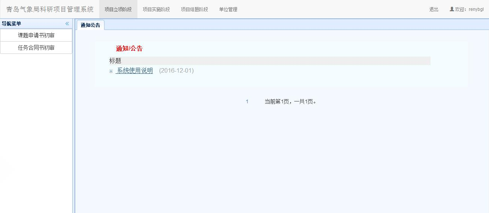
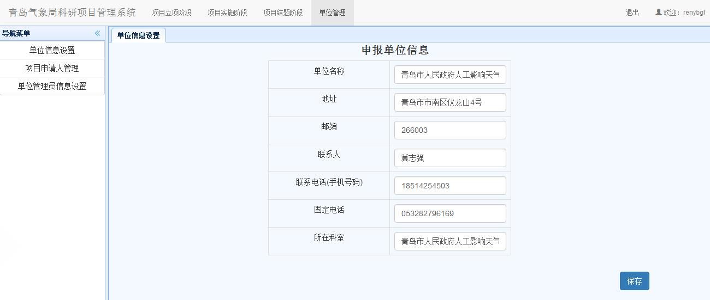
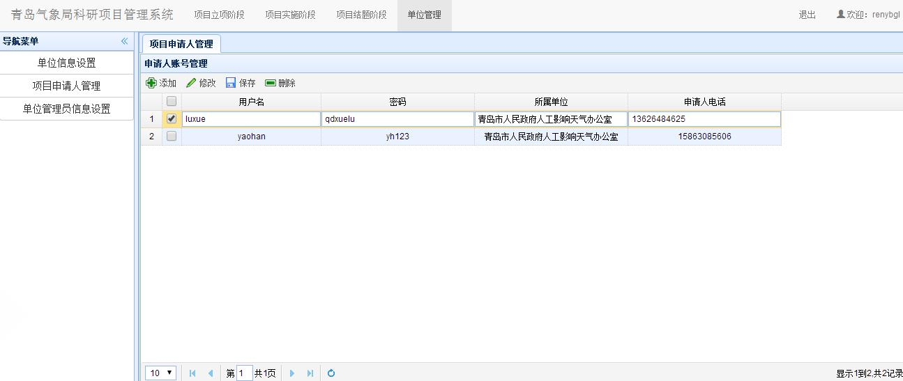

# 登录及信息管理（单位管理员）
## 登录
　　单位管理员打开“科研管理系统”主页，显示如下登录页面，输入用户名与密码后回车或点击`登录`按钮即可：

　　登录成功后，显示如下系统主界面：
  

　　通过点击屏幕上方的导航条，可以进入对应的项目立项、项目实施、项目结题和单位管理模块。
　　

## 个人信息管理
　　第一次登录系统后，请首先点击`单位管理`模块，并点击左边的`单位信息设置`后，修改单位信息。修改完成后，点击保存即可，如下图所示。

## 项目申请人管理
　　点击左边导航栏的`项目申请人管理`后，可对本单位当前项目申请人进行添加，修改，删除操作，然后保存。如下图所示。
***注意：申请人在此处添加后，才能登陆系统。***

## 单位管理员信息设置
　　点击左边导航栏的`单位管理员信息设置`后，可修改单位管理员本身的信息，例如登陆密码。　　　　　　　　　　　　　　　　
