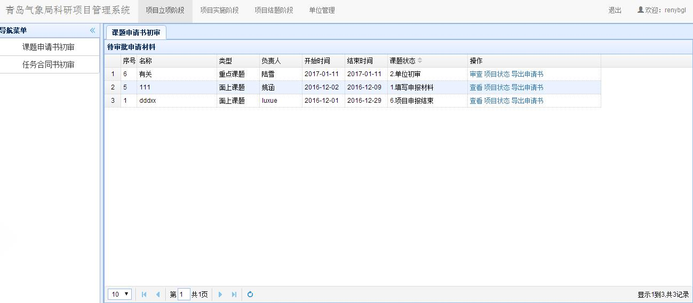
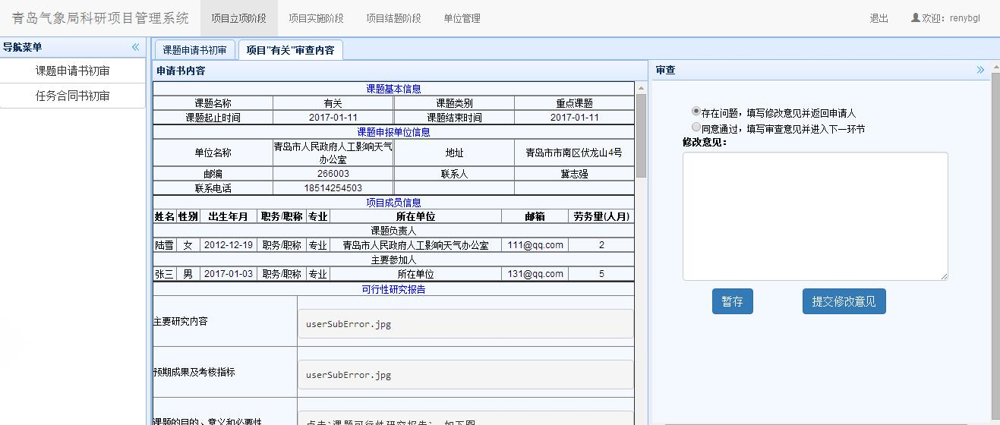
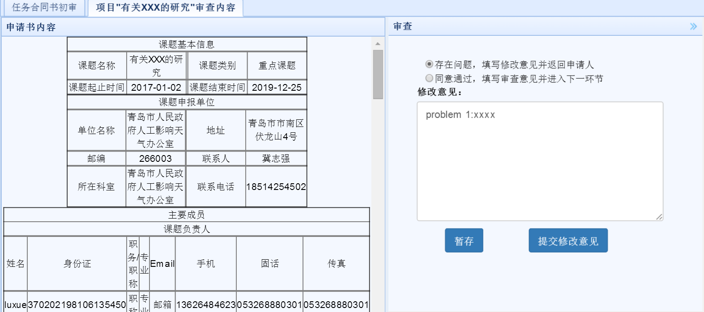
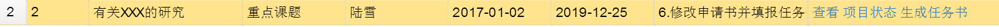

# 项目立项阶段
　　单位管理员在主界面上部导航条点击`项目立项阶段`，即可进入立项阶段界面。
## 课题申请书初审
### 待审批申请书列表
　　在项目立项阶段界面，点击左侧`课题申请书初审`链接，可以显示课题申请书初审模块，如下图所示，显示界面中包含了当前单位的所有项目列表。

### 申请书初审
　　列表中，课题状态一栏中应该进行处理的课题显示在最前面，并能进行审查操作，如果状态不是当前进行处理的，则操作一栏中只显示查看。其他操作同申请人操作。点击`审查`后，能查看申请项目的基本信息，如下图。
   
　　右边是审查界面，若选择存在问题选项，则在下方填写修改意见，提交修改意见后会返回给申请人，课题状态恢复成第一步`1.填写申报材料`，申请人登录后，通过点击课题申请书操作一栏中新增的`审查及评审意见`选项，查看意见后修改信息并提交。
　　若没有问题，则选择同意通过选项，并点击`提交审查意见`，课题进入下一个状态`3.气象局初审`，如下图。点击暂存按钮则是临时保存修改意见。提交后等待气象局管理员进行初审。
  

### 任务书初审
　　点击上方`项目立项阶段`，左侧`任务合同书初审`进入任务书列表，任务书列表中，课题状态一栏中应该进行处理的课题显示在最前面，并能进行审查操作，如果状态不是当前进行处理的，则操作一栏中只显示`查看`。点击`审查`后，能查看任务书的基本信息，如下图。

　　右边是审查界面，若选择`存在问题`选项，则在下方填写修改意见，并点击`提交修改意见`会返回给申请人，课题进入状态`6.修改申请书并填报任务`。
　　若没有问题，则选择`同意通过`选项，并点击`提交修改意见`，如下图。点击暂存按钮则是临时保存修改意见。提交成功后等待气象局管理员进行初审。

