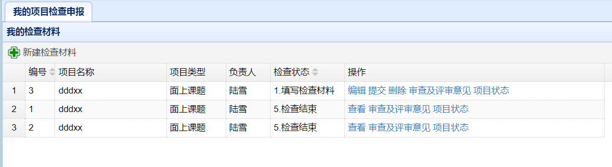
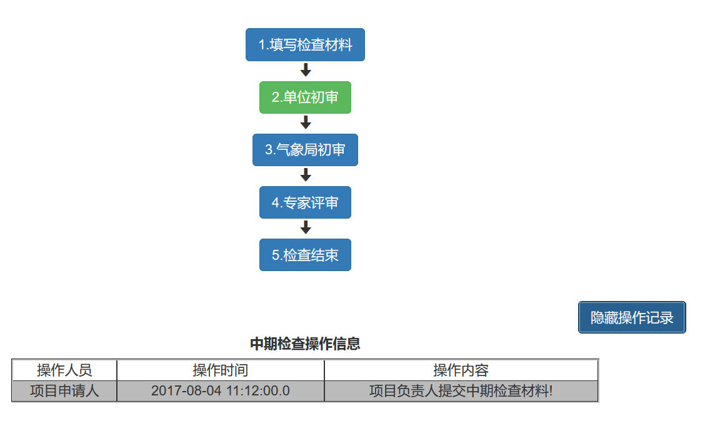
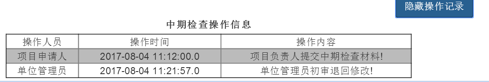
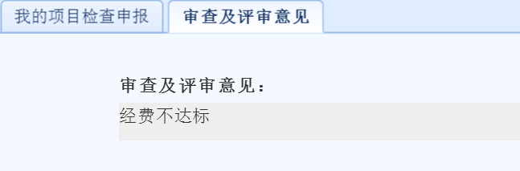
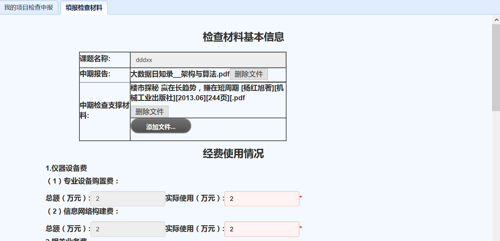

项目实施阶段（项目负责人）

　　用户在主界面上部导航条点击`项目实施阶段`，即可进入实施阶段界面。
# 项目检查管理
* 中期检查材料列表。在项目实施阶段界面，点击左侧`我的项目检查申报`链接，可以显示当前用户作为负责人的所有中期检查材料列表，如下图所示。

* 新建中期检查材料。点击中期检查材料列表上方的`新建检查材料`，在弹出的对话框内选择待检查的课题名字，点击`新建中期检查`，即可进入材料填报页面。
* 提交中期检查材料。点击中期检查材料后的`提交`链接，即可提交保存的中期检查材料。
* 编辑中期检查材料。点击中期检查材料后的`编辑`链接，即可编辑原先保存的中期检查材料。
* 删除中期检查材料。点击中期检查材料后的`删除`链接，即可删除中期检查材料。
* 查看中期检查状态。可以在检查项目之后的`检查状态`栏看到项目当前所处的状态，也可以点击项目之后的`项目状态`链接，看到当前项目的状态，如下图所示。

* 查看审查及评审意见。负责人可以通过查看当前检查状态中的`显示操作状态`发现各级管理员的操作，如下图所示。

这时点击项目后的`审查及评审意见`即可看到各级管理员的意见并根据意见进行修改。如下图所示。

如果项目状态为`5.检查结束`，这时点击项目后的`审查及评审意见`即可看到评审专家意见并根据意见进行修改。如下图所示。

# 填报中期检查材料
  　　在新建和编辑中期检查材料时，会进入如下图所示界面。

  　　点击`添加文件`按钮，可以上传中期坚持支撑材料，一次可以上传多个文件，文件大小最大不超过`100M`，文件类型可以包括各种文档图片及压缩包类型。
　　对已经上传的文件，点击`删除文件`按钮，可以删除上传的文件。
　　支撑材料及经费使用情况填写好后，点击`保存`按钮即可保存填写的内容。

*** 注意：只有在中期检查材料列表中对项目材料进行提交，材料才会进行上报，仅保存不会上报。***
