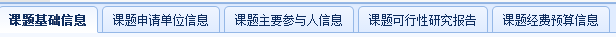
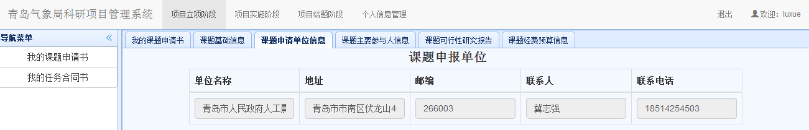
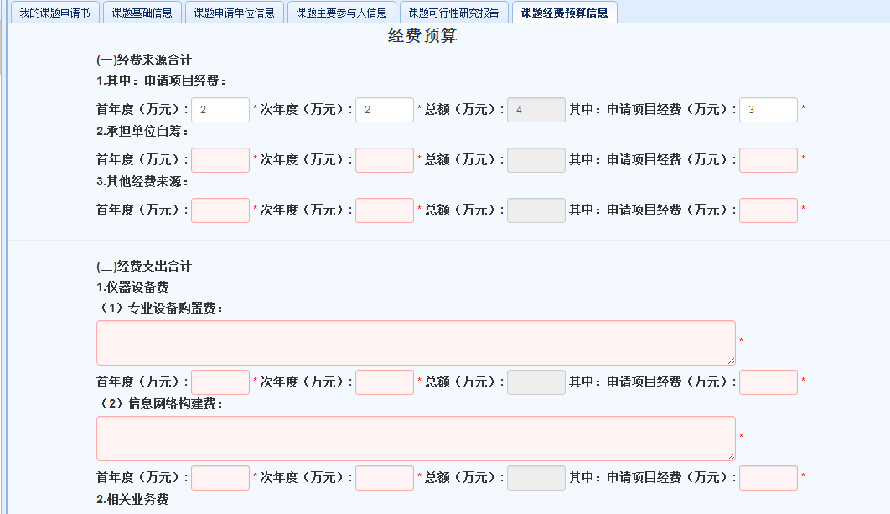
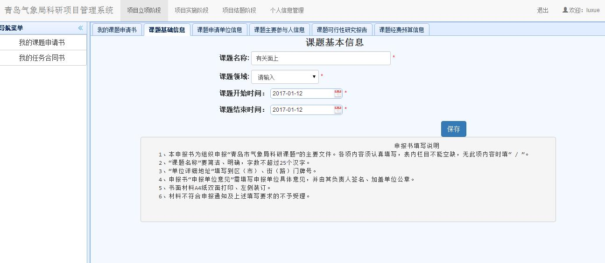
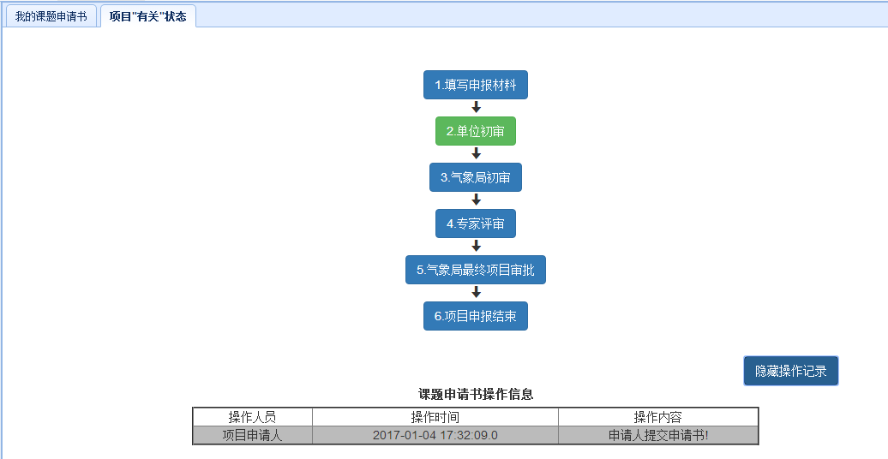

# 项目实施阶段（项目负责人）

　　用户在主界面上部导航条点击`项目实施阶段`，即可进入实施阶段界面。
## 项目检查申报
* 中期检查材料列表。在项目实施阶段界面，点击左侧`我的项目检查申报`链接，可以显示当前用户作为负责人的所有中期检查材料列表，如下图所示。

* 新建中期检查材料。点击中期检查材料列表上方的`新建检查材料`，在弹出的对话框内选择待检查的课题名字，点击`新建中期检查`，即看进入材料填报页面。
* 编辑中期检查材料。点击中期检查材料后的`编辑`链接，即看编辑原先保存的中期检查材料。
* 删除中期检查材料。点击中期检查材料后的`删除`链接，即看删除中期检查材料。

### 课题填报内容
  　　需要填报的内容共有5个部分。
  
    +  以`重点课题`为例
  　　1. 选择并点击新建课题后，转到课题基础信息界面，如下图所示。根据系统提示输入课题基本信息，页面底端有申报的填写说明。带有*符号的关键数据必须输入，点击按钮录入信息。
 
  　　2. 点击上方选项卡`课题申请单位信息`，这里的信息，如下图，是由单位管理员提前录入的，浏览过后无需修改。
  
  　　3. 点击`课题主要参与人信息`，如下图，可以完善课题负责人的基本信息，并且添加课题主要参与人。
  
  点击按钮录入信息。
  　　4. 点击`课题可行性研究报告`，如下图，填写完所有带*符号的必填项，保存。
  
  　　5. 点击`课题经费预算`，如下图，经费预算分为两部分，第一部分是来源合计，在重点课题类型里，填写首年度和次年度经费后会自动计算出总额。第二部分是支出合计，根据页面文字提示填写完整并保存。
  
  　　6. 若发现填写有误，则可点击`删除`操作删除，只可在第一阶段进行删除。
    ***注意：如果课题信息未填写完整，点开`我的课题申请书`界面，在刚刚新建的重点课题的操作一栏里，提交课题后会提示信息不完整的错误，如下图。因此点击编辑操作将信息完善后才能成功提交。***
  
    + 以 `面上课题`为例
     1. 选择并点击新建课题后，转到课题基础信息界面，如下图所示。根据系统提示输入课题基本信息。
    
     2. 之后操作同`重点课题`。
### 课题成功提交后的操作
　　当课题成功提交后，在我的申请材料，课题状态一栏下显示的是单位初审状态。在操作一栏中，如下图。

　　对已经成功提交的课题不能进行修改，只可通过`查看`操作查看信息，点击`项目状态`可查看当前项目进行的状态，点击右下角的`显示操作记录`可查看操作记录如下图。

　　点击`导出项目申请书`，可以自动将课题的完整信息保存为word文档格式并输出到本地。

### 初审修改
　　申请人登录后，如果单位管理员，气象局管理员评审未通过项目，则通过点击课题申请书操作一栏中新增的`审查及评审意见`选项，查看意见后修改信息并提交给单位管理员，

### 申报成功
　　课题若申报成功，则显示如下界面。可进行查看`项目状态`等操作。

　　点击导航栏的`我的任务合同书`，可看到同名项目条目，则表示实施成功。

### 申报不成功
　　课题若申报不成功，点击`审查及评审意见`选项，则显示如下界面。且任务合同书内没有同名项目。

