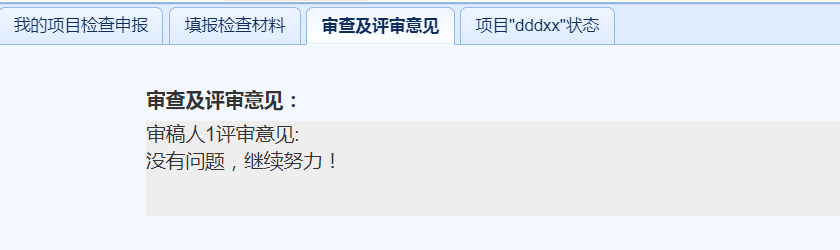

项目结题阶段（项目负责人）

　　用户在主界面上部导航条点击`项目结题阶段`，即可进入结题阶段界面。
# 结题材料管理
* 结题材料列表。在项目实施阶段界面，点击左侧`我的项目结题申报`链接，可以显示当前用户作为负责人的所有结题材料列表，如下图所示。

* 新建结题申请。点击结题材料列表上方的`新建结题申请`，在弹出的对话框内选择待结题的课题名字，点击`新建结题申请`，即可进入材料填报页面。
* 编辑结题材料。点击结题材料后的`编辑`链接，即可编辑原先保存的结题材料。
* 提交结题材料。新建或者编辑后，点击项目后的`提交`链接，即可提交保存的结题材料。
* 删除结题材料。点击结题材料后的`删除`链接，即可删除该项目对应的结题材料。
* 查看结题检查状态。可以在项目之后的`检查状态`栏看到项目当前所处的状态，也可以点击项目之后的`项目状态`链接，看到当前项目的状态，如下图所示。

* 查看审查及评审意见。负责人可以通过查看当前检查状态中的`显示操作状态`发现各级管理员的操作。
这时点击项目后的`审查及评审意见`即可看到各级管理员的意见并根据意见进行修改。如下图所示。

如果项目状态为`5.检查结束`，这时点击项目后的`审查及评审意见`即可看到评审专家意见并根据意见进行修改。如下图所示。

# 填报项目结题材料
  　　在新建和编辑项目结题材料时，会进入如下图所示界面。

  　　点击`添加文件`按钮，可以上传要求的结题材料，按照系统要求一次可以上传1个或多个文件，文件大小最大不超过`100M`，文件类型可以包括各种文档图片及压缩包类型。

　　对已经上传的文件，点击`删除文件`按钮，可以删除上传的文件。

　　结题材料选择好后，点击`保存`按钮开始上传并保存结题材料。

*** 注意：只有在结题材料列表中对项目材料进行提交，材料才会进行上报，仅保存不会上报。***

# 填写结题评审意见
  　　项目进入状态`填写结题评审意见`后，在结题项目列表项目后点击`编辑`会进入填写结题评审意见界面，如下图所示。

  　　点击`添加文件`按钮，可以上传要求的结题扫描材料，按照系统要求一次可以上传1个或多个文件，文件大小最大不超过`100M`，文件类型可以包括各种文档图片及压缩包类型。  
    　　对已经上传的文件，点击`删除文件`按钮，可以删除上传的文件。  
　　结题材料选择好后，点击`保存`按钮开始上传并保存结题材料。

*** 注意：只有在结题材料列表中对项目材料进行提交，材料才会进行上报，仅保存不会上报。***

# 查看归档材料
　　项目结题后，结题材料变成归档材料。在项目结题阶段界面，点击左侧`我的归档项目`，可以显示所有归档材料，点击归档材料后的`查看`， 可以查看归档材料的内容，点击材料后的下载按钮可以下载对应的归档材料。如下图所示。

