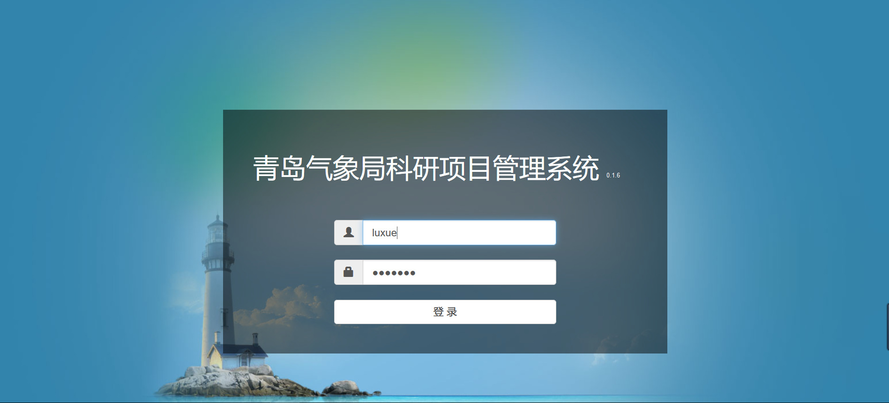
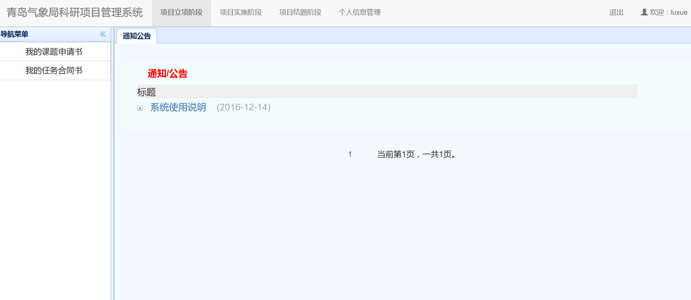

登录及个人信息管理(申请人)

　　申请人/负责人指开始建立项目，提交各种材料的操作人员。在项目立项阶段，该操作人员被称为申请人，如果立项成功，在项目实施和项目结题阶段，被称作负责人。项目申请人和负责人为同一人。

　　申请人账户由单位管理员负责创建并告知申请操作人员，立项成功后，申请人可以继续使用该账户进行项目负责人的相关操作。
# 登录
　　项目申请人打开“科研管理系统”主页，显示如下登录页面，输入用户名与密码后回车或点击`登录`按钮即可：

　　登录成功后，显示如下系统主界面：
  

　　通过点击屏幕上方的导航条，可以进入对应的项目立项、项目实施、项目结题和个人信息管理模块。
　　

# 个人信息管理
　　第一次登录系统后，请首先点击`个人信息管理`模块，并点击左边的`用户个人信息设置`后，修改个人信息。修改完成后，点击保存即可，如下图所示。  
　　***注意：填报课题申报书之前必须先完善用户个人信息，否则无法进行新建申报项目。***

