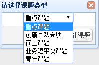
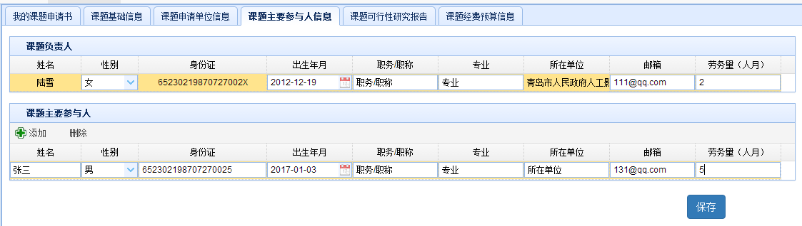
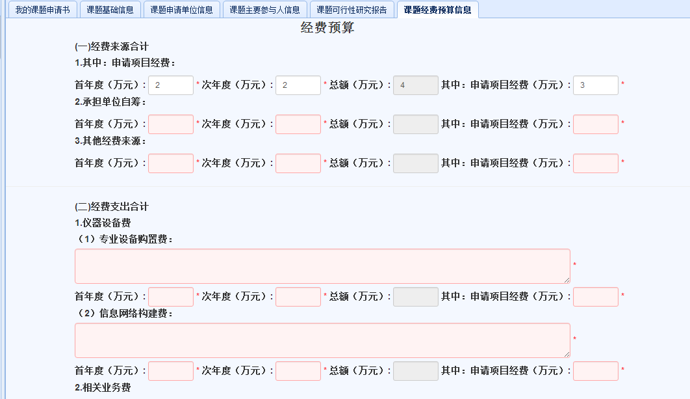
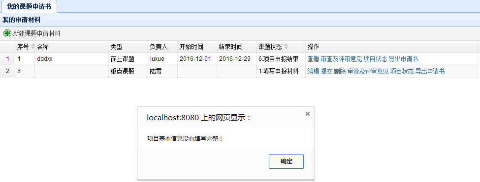

# 项目立项阶段
　　用户在主界面上部导航条点击`项目立项阶段`，即可进入立项阶段界面。
## 我的课题申请书
### 申请材料列表
 　　在项目立项阶段界面，点击左侧`我的课题申请书`链接，可以显示我的课题申请书模块，如下图所示，显示界面中包含了当前用户的所有申请材料列表。
 

### 新建课题申请材料
 　　点击申请材料列表上方的`新建课题申请材料`，在弹出的对话框内选择课题类型。共有五种课题类型分两大类，前两种重点课题和创新团队专项填报的信息相同，后三种填报的信息相同。
### 课题填报内容
  　　需要填报的内容共有5个部分。
  
  　　1. 以重点课题为例，选择并点击新建课题后，转到课题基础信息界面，如下图所示。根据系统提示输入课题基本信息，页面底端有申报的填写说明。带有*符号的关键数据必须输入，点击按钮录入信息。
 
  　　2. 点击上方选项卡`课题申请单位信息`，这里的信息，如下图，是由单位管理员提前录入的，浏览过后无需修改。
  
  　　3. 点击`课题主要参与人信息`，如下图，可以完善课题负责人的基本信息，并且添加课题主要参与人。
  
  点击按钮录入信息。
  　　4. 点击`课题可行性研究报告`，如下图，填写完所有带*符号的必填项，保存。
  
  　　5. 点击`课题经费预算`，如下图，经费预算分为两部分，第一部分是来源合计，在重点课题类型里，填写首年度和次年度经费后会自动计算出总额。第二部分是支出合计，根据页面文字提示填写完整并保存。
  
  ***注意：如果课题信息未填写完整，点开`我的课题申请书`界面，在刚刚新建的重点课题的操作一栏里，提交课题后会提示信息不完整的错误，如下图。因此点击编辑操作将信息完善后才能成功提交。***
  
### 课题成功提交后的操作
  　　当课题成功提交后，在我的申请材料，课题状态一栏下显示的是单位初审状态。在操作一栏中，如下图。
  
  　　对已经成功提交的课题不能进行修改，只可通过`查看`操作查看信息，点击`项目状态`可查看当前项目进行的状态，点击右下角的`显示操作记录`可查看操作记录如下图。
  
  　　点击`导出项目申请书`，可以自动将课题的完整信息保存为word文档格式并输出到本地。
