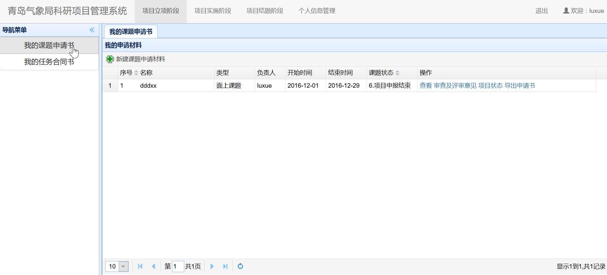
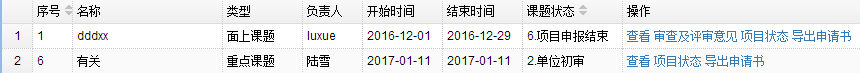

<!-- ex_nonav -->
# 项目立项阶段（申请人）

　　用户在主界面上部导航条点击`项目立项阶段`，即可进入立项阶段界面。
## 我的课题申请书
### 申请材料列表
 　　在项目立项阶段界面，点击左侧`我的课题申请书`链接，可以显示我的课题申请书模块，如下图所示，显示界面中包含了当前用户的所有申请材料列表。
 

### 新建课题申请材料
 　　点击申请材料列表上方的`新建课题申请材料`，在弹出的对话框内选择课题类型。共有五种课题类型分两大类，前两种重点课题和创新团队专项填报的信息相同，后三种填报的信息相同。
### 课题填报内容
  　　需要填报的内容共有5个部分。
  
*  以`重点课题`为例

  　　1. 选择并点击新建课题后，转到课题基础信息界面，如下图所示。根据系统提示输入课题基本信息，页面底端有申报的填写说明。带有\*符号的关键数据必须输入，点击按钮录入信息。
 
  　　2. 点击上方选项卡`课题申请单位信息`，这里的信息，如下图，是由单位管理员提前录入的，浏览过后无需修改。
  
  　　3. 点击`课题主要参与人信息`，如下图，可以完善课题负责人的基本信息，并且添加课题主要参与人。
  
  点击按钮录入信息。
  　　4. 点击`课题可行性研究报告`，如下图，填写完所有带*符号的必填项，保存。
  
  　　5. 点击`课题经费预算`，如下图，经费预算分为两部分，第一部分是来源合计，在重点课题类型里，填写首年度和次年度经费后会自动计算出总额。第二部分是支出合计，根据页面文字提示填写完整并保存。
  
  　　6. 若发现填写有误，则可点击`删除`操作删除，只可在第一阶段进行删除。
    ***注意：如果课题信息未填写完整，点开`我的课题申请书`界面，在刚刚新建的重点课题的操作一栏里，提交课题后会提示信息不完整的错误，如下图。因此点击编辑操作将信息完善后才能成功提交。***
  
*  　以 `面上课题`为例

    1. 选择并点击新建课题后，转到课题基础信息界面，如下图所示。根据系统提示输入课题基本信息。

    2. 之后操作同`重点课题`。
### 课题成功提交后的操作
　　当课题成功提交后，在我的申请材料，课题状态一栏下显示的是单位初审状态。在操作一栏中，如下图。

　　对已经成功提交的课题不能进行修改，只可通过`查看`操作查看信息，点击`项目状态`可查看当前项目进行的状态，点击右下角的`显示操作记录`可查看操作记录如下图。

　　点击`导出项目申请书`，可以自动将课题的完整信息保存为word文档格式并输出到本地。

### 初审修改
　　申请人登录后，如果单位管理员，气象局管理员评审未通过项目，则通过点击课题申请书操作一栏中新增的`审查及评审意见`选项，查看意见后修改信息并提交给单位管理员，

### 申报成功
　　课题若申报成功，则显示如下界面。可进行查看`项目状态`等操作。

　　点击导航栏的`我的任务合同书`，可看到同名项目条目，则表示立项成功。

### 申报不成功
　　课题若申报不成功，点击`审查及评审意见`选项，则显示如下界面。且`我的任务合同书`内没有同名项目。

## 我的任务合同书
### 任务书合同列表
 　　在项目立项阶段界面，点击左侧`我的任务书合同`链接，可以显示我的任务书合同，如下图所示，显示界面中包含了当前用户的所有任务书合同列表。

***注意： 只有立项申请成功的项目才会显示在任务书合同列表中。***


### 填写任务书
　　在任务书列表中，对于出于申报阶段的任务书，操作中会显示`编辑`链接，点击`编辑`，进入任务书申报页面，共有5类信息需要填写，如下图所示。

　　任务书申报填写内容同申请书材料相似，填报的内容根据项目的类型不同而有所区别。每一类信息填写好之后，点击该tab页面中的`保存`按钮进行保存，5类信息都填写好后，点击`我的任务合同书`，切换到任务书列表后，点击对应任务书后面的`提交`链接进行提交。

***注意： 提交成功后，对应任务书后面的`提交`链接变成`显示`链接。任务书提交之后无法撤回修改！***


### 根据意见修改任务书
　　如果单位管理员或者气象局管理员在任务书审批过程中发现有问题没有通过，则会驳回并附带修改意见。点击任务书后方的`评审意见`链接，可以查看修改意见，如下图。在任务书列表中点击任务书后方的`编辑`链接即可进行修改，修改后的保存提交同填写任务书的操作。


### 查看任务书状态
　　点击任务书后方的`项目状态`链接，可以随时查看当前任务书的处理状态，如下图所示。

